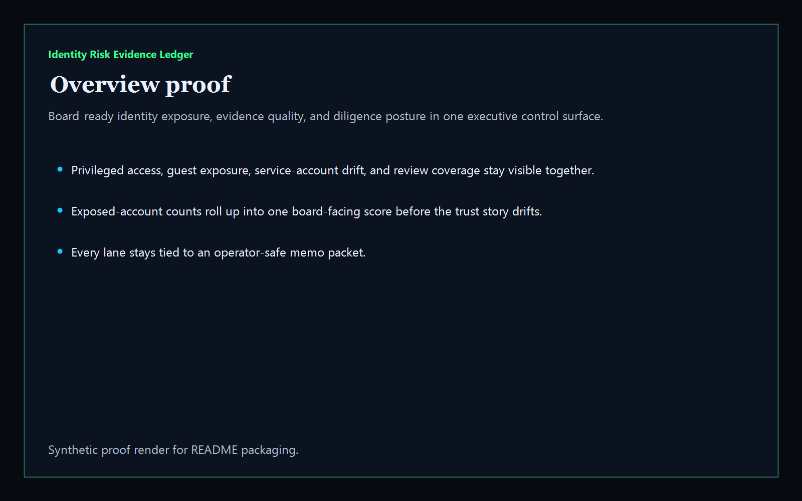
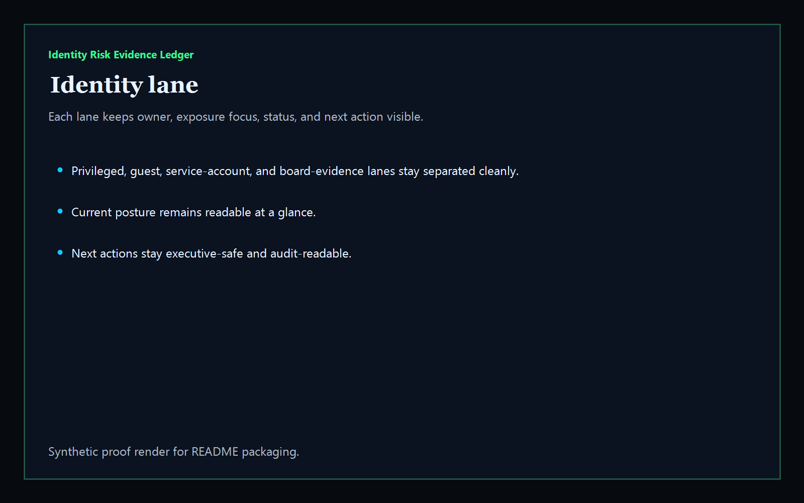
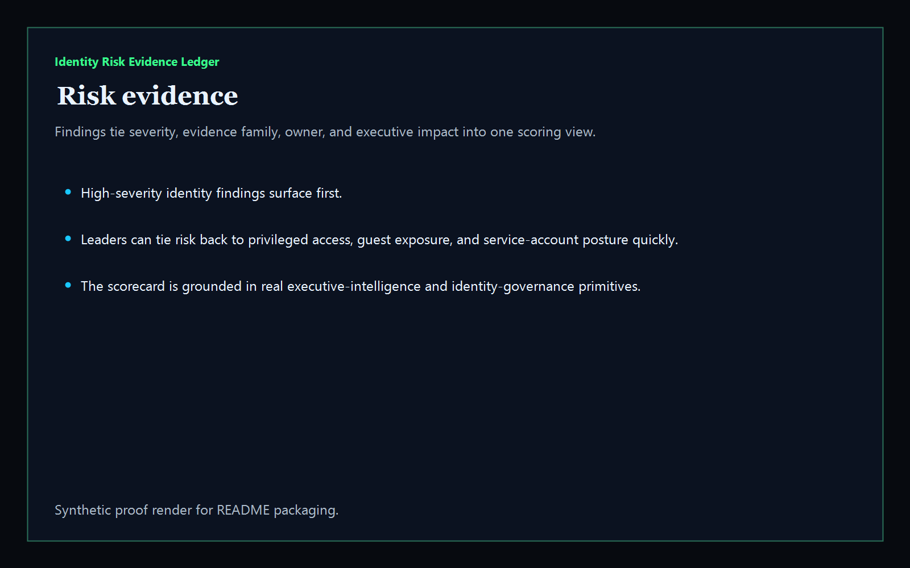
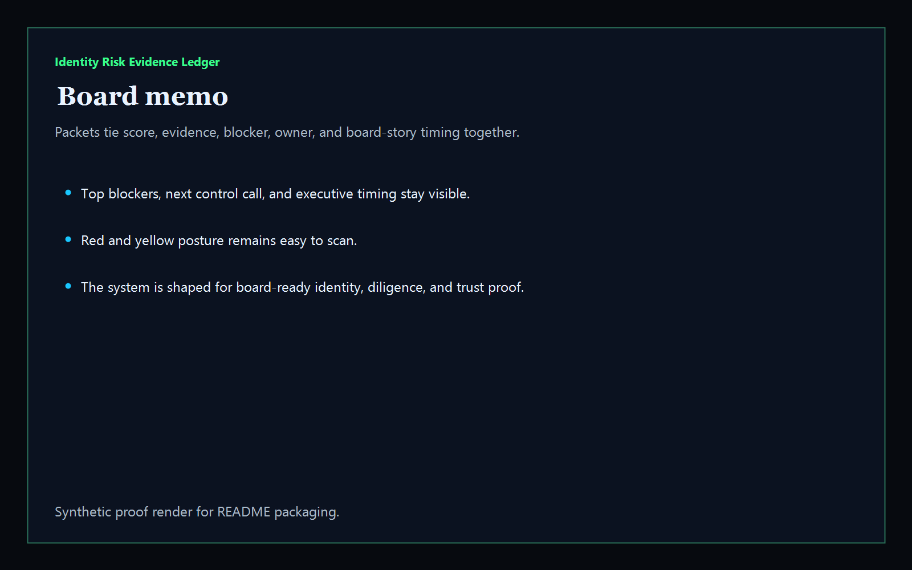

# Identity Risk Evidence Ledger

[](https://github.com/mizcausevic-dev/identity-risk-evidence-ledger/actions/workflows/ci.yml)
[](https://github.com/mizcausevic-dev/identity-risk-evidence-ledger/actions/workflows/pages.yml)

Board-ready executive intelligence product for identity risk evidence. It turns synthetic review packets into one scorecard covering privileged access, guest exposure, service-account drift, MFA gaps, vendor trust evidence, review coverage, and memo-ready diligence posture.

## What it does

- executive scorecard for identity exposure, evidence quality, investment priority, and board story
- identity-lane view for privileged access, guest exposure, service-account ownership, and board-evidence readiness
- risk-evidence view for board-facing findings and owners
- board-memo packet view for diligence-ready executive summaries
- public synthetic control surface plus JSON APIs and CLI

## Routes

- `/`
- `/identity-lane`
- `/risk-evidence`
- `/board-memo`
- `/verification`
- `/docs`

## API

- `/api/dashboard/summary`
- `/api/identity-lane`
- `/api/risk-evidence`
- `/api/board-memo`
- `/api/verification`
- `/api/sample`

## Why this matters (KG Embedded tie-back)

This repo is the board-intelligence shape of Kinetic Gain Embedded for identity governance and executive diligence. The same primitive can power executive scorecards, operating-partner diligence, control benchmarking, and board memos without exposing live tenant systems or write paths.

## Screenshots






## CLI

```powershell
npx identity-risk-evidence-ledger .\fixtures\identity-risk-evidence.json --format markdown
```

## Local run

```powershell
cd identity-risk-evidence-ledger
npm install
npm run verify
npm run prerender
npm run render:assets
npm run start
```

Then open:

- [http://127.0.0.1:5533/](http://127.0.0.1:5533/)
- [http://127.0.0.1:5533/identity-lane](http://127.0.0.1:5533/identity-lane)
- [http://127.0.0.1:5533/risk-evidence](http://127.0.0.1:5533/risk-evidence)
- [http://127.0.0.1:5533/board-memo](http://127.0.0.1:5533/board-memo)

## Live

- [https://identity.kineticgain.com/](https://identity.kineticgain.com/)

This repo publishes synthetic sample identity-risk data only. It does not ship live tenant credentials, production directory exports, or authenticated write paths.
